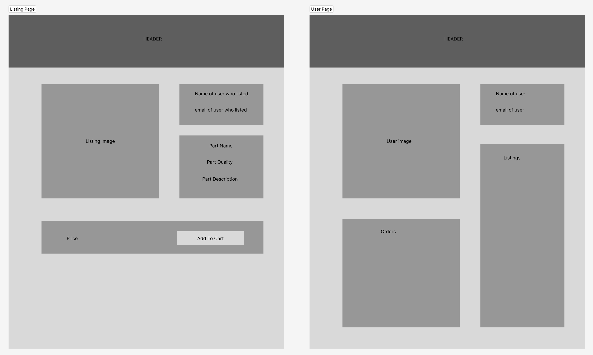
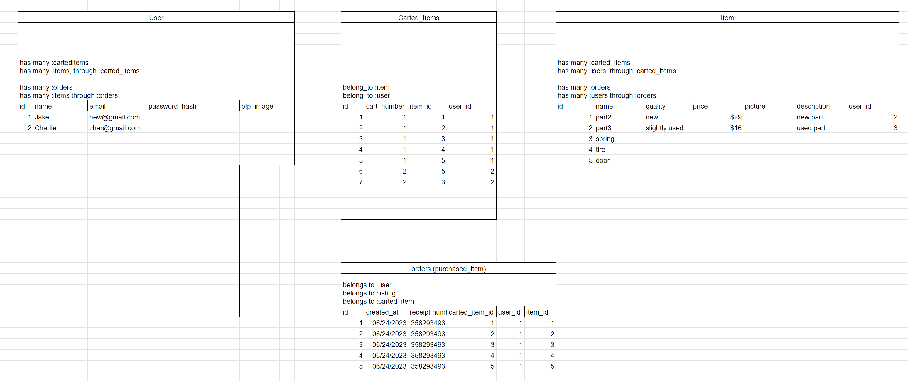

# Stop & Shop

Stop and shop is your one stop destination to find used car parts.

## Wireframe

## React Tree

## Schema

## API Routes

|   API Route   	| HTTP Verb 	|                  Purpose                 	| Deliverable 	|
|:-------------:	|:---------:	|:----------------------------------------:	|:-----------:	|
| /user_profile 	| GET       	| Display user profile                     	| MVP         	|
| /user_profile 	| PATCH     	| Edit user profile                        	| MVP         	|
| /user_profile 	| DELETE    	| Delete user profile                      	| MVP         	|
| /users        	| GET       	| Display all users                        	| MVP         	|
| /user/:id     	| GET       	| Display selected user profile            	| MVP         	|
| /listings     	| GET       	| Display all listings                     	| MVP         	|
| /listings     	| POST      	| Add a listing to the page                	| MVP         	|
| /listing/:id  	| GET       	| Display selected listing                 	| MVP         	|
| /listing/:id  	| POST      	| Add a comment to the listing             	| STRETCH     	|
| /listing/:id  	| PATCH     	| Edit selected listing                    	| MVP         	|
| /listing/:id  	| DELETE    	| Delete selected listing                  	| MVP         	|
| /orders       	| GET       	| Display all orders for the selected user 	| MVP         	|
| /orders       	| POST      	| Create a new order                       	| MVP         	|
| /cart         	| GET       	| Display all carted items                 	| MVP         	|
| /cart         	| DELETE    	| Delete items from the cart               	| MVP         	|

## Stretch Goals

1. Allow for messaging between buyer and seller
2. Have a message appear with new orders when someone logs in
3. Have a quality of service rating for all users
4. Have a favorites feature for users to favorite listings
5. Allow for buyers to comment on listings

## Trello

